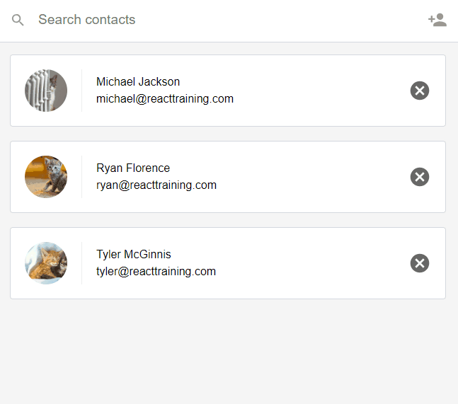

 ## Contacts with React.js

A React app that allows you to search, filter, delete and add new contact cards.

 - Used React to create and render Contact Cards
 - Converted manual element creation to JSX, used create-react-app to scaffold this project
 - Passed data into components, created functional components
 - Used PropTypes, Escape-string-regexp, Sort-by 
 - Rendered UI with external data via fetch
 - Managed app location with React Router
 
 

This project was an exercise from Udacity Front-End Web Dev Nanodegree; bootstrapped with [Create React App](https://github.com/facebookincubator/create-react-app).

